<!--
_class: title
_footer: ''
-->

# **TREEHOOSE**: Trusted Research Environment and Enclave for Hosting Original Open Scientific Exploration

## UKRI Cloud workshop 2022 Simon Li Health Informatics Centre, University of Dundee

###  [@penguinoops](https://twitter.com/penguinoops)

'
'

---
<!--
_class: title
_footer: ''
-->

# 1. HIC Trusted Research Environment
# 2. TREEHOOSE: aims of this project
# 3. What we've achieved and learnt so far

<!--
4 mins, 8 mins, 8 mins
-->
<!-- --- -->
<!-- _class: title -->
<!-- # 1. Trusted Research Environments -->

<!-- There's a UK BIOBANK invited talk in the preceding session, so may need to tailor this section depending on what's presented

What are they
Who uses them
Physical (building) vs virtual (online) security -->

---
# Basic principles of a TRE: The 5 safes

**Safe data**: data is treated to protect any confidentiality concerns.
**Safe projects**: research projects are approved by data owners for the public good.
**Safe people**: researchers are trained and authorised to use data safely.
**Safe settings**: a secure environment prevents unauthorised use.
**Safe outputs**: screened and approved outputs that are non-disclosive.

*https://ukdataservice.ac.uk/help/secure-lab/what-is-the-five-safes-framework/*

---
<!-- _footer: '' -->
# Who uses our TRE?
A very wide range of users requiring a full compute environment
- non-technical users working with Windows desktop applications
- technical developers with knowledge of using cloud infrastructure

---
- Storage is in one AWS account, separated by project
- Researcher workspaces in a separate AWS account
- Virtual display restricts copy/paste, web-browser is the only interface
- No cross-over of user data between projects

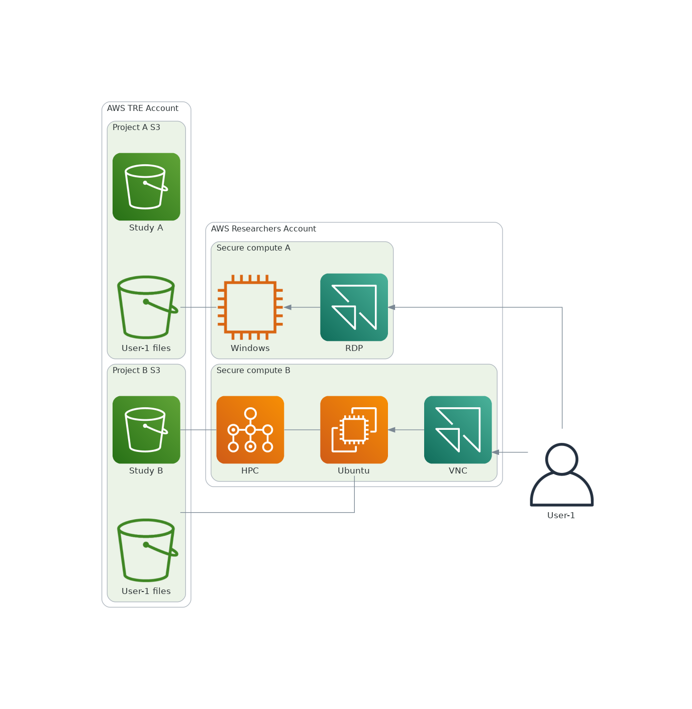

---
<!-- _footer: '' -->

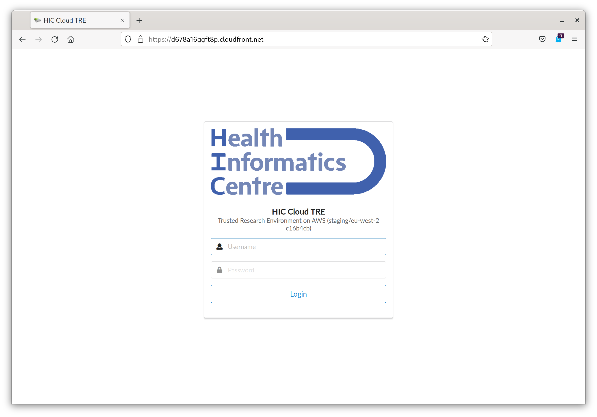

---
<!-- _footer: '' -->

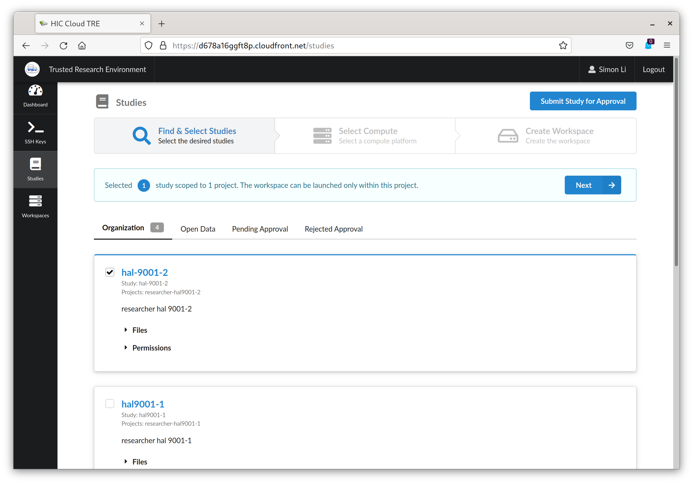

---
<!-- _footer: '' -->

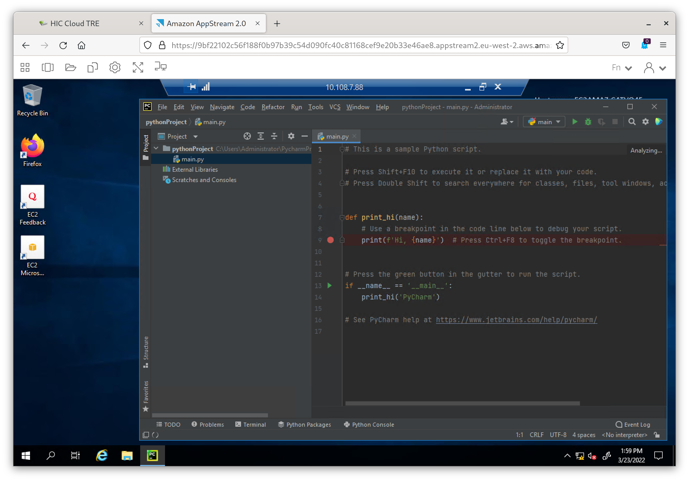

---
<!-- _footer: '' -->

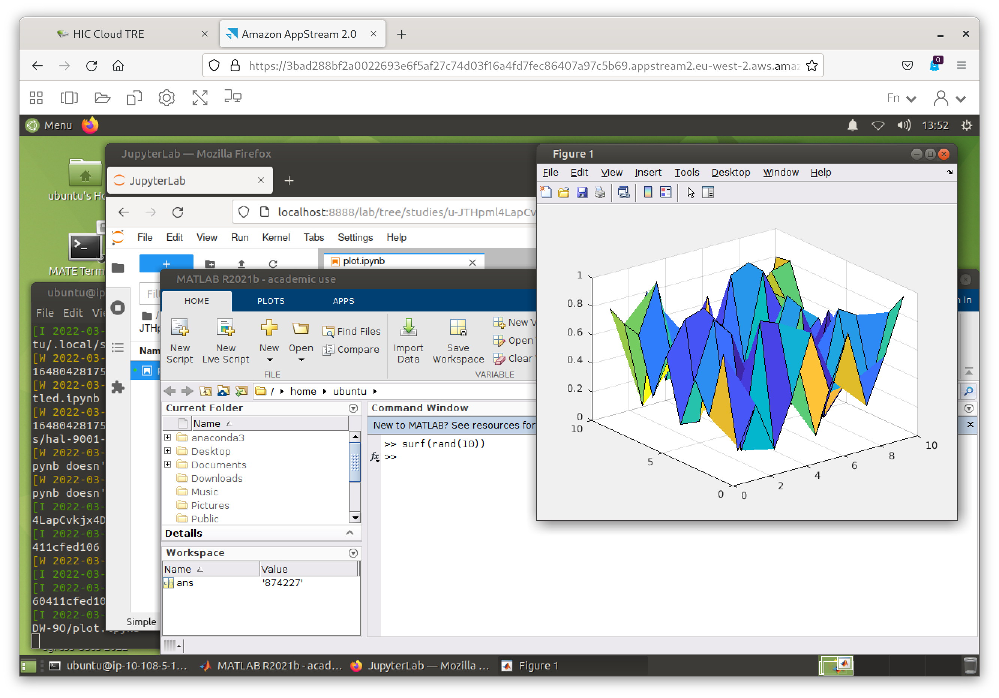

---

### Trusted Research Environment
developed in conjunction with AWS

### and Enclave
a secure environment for providing mutual protection of data and code from different parties

### for Hosting Open Original Science Exploration
open infrastructure supporting open science

---
# Providing an open-source Cloud TRE platform

HIC have been running a Cloud TRE for around a year, now want to make it available to the wider community.

Initial focus on documentation and workflows for deploying and managing TREs, along with ensuring our customisations such as workflows and environments are generally applicable.

Platform to _sustainably_ and _collaboratively_ develop Cloud TREs across disciplines

<!--
Fully open-source TRE that anyone with cloud skills can deploy
- Caveat: not handling governance of TREs (at least not yet, maybe in future though!)
-->

---
# Why?
Supporting open-science

Plus one step towards supporting federation- common codebase makes it easier to interoperate, and eventually develop open standards

Efficiency: together we share the costs and learn from each other

---

# Secure enclave: resolving two conflicting requirements

We want to retain full control of our data

Commercial partner wants to maintain confidentiality of their analysis code

---
# Hand-wavy explanation of secure enclaves

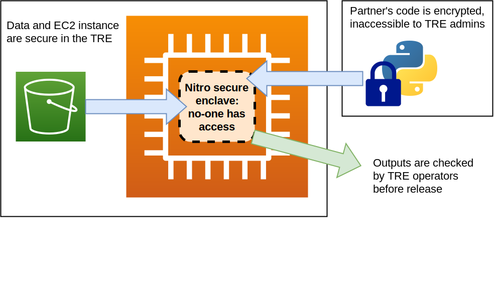

<!--
HIC owns the AWS instance running in our TRE: our data is secure

Partner: Enclave containing encrypted code runs inside the AWS instance: HIC don't have access to it

If both parties are happy then enclave is authorised to run code, AWS does some magic

Analysis outputs are reviewed by HIC before they are copied out of the TRE

AWS Nitro Enclaves: https://aws.amazon.com/ec2/nitro/nitro-enclaves/
-->

---
<!--
_class: title
_footer: ''
-->

# What we've achieved and learnt so far from running a TRE in the cloud

---
# Benefits we've already received: flexibility of compute

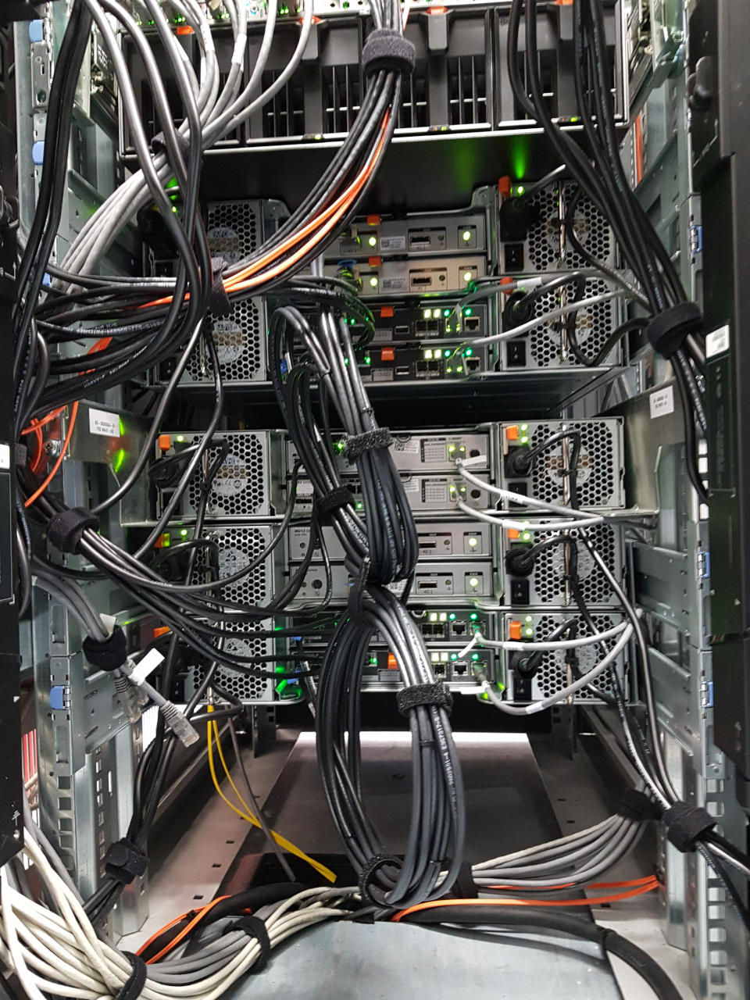

More software, more CPUs/memory, access to GPUs, unlimited storage

Instant purchases: no institutional purchasing process to go through

AWS deals with the hardware including upgrades

---
# Tailoring of security boundaries

Virtual networks are easy to configure, choose between:

- segregation at local firewall
- network (VLAN/VPC)
- AWS account level

with cost tradeoffs

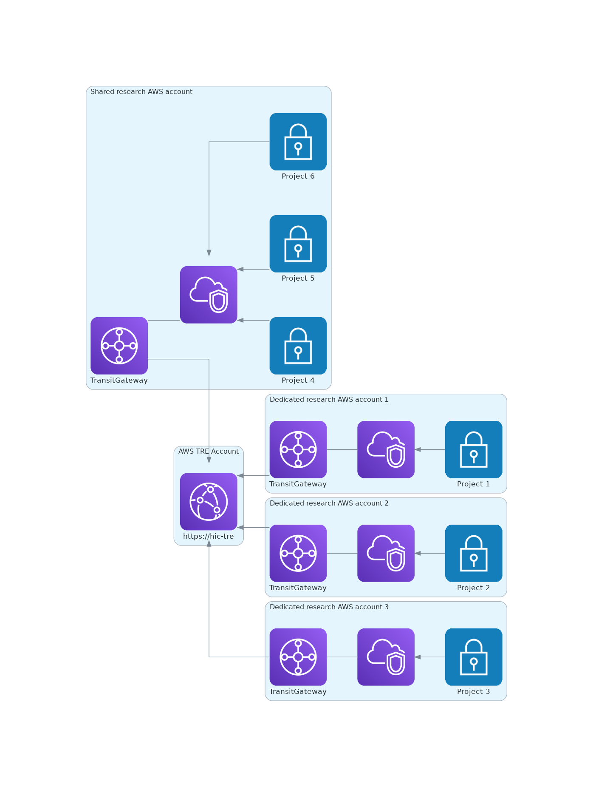

---
# Building research environments in code

Using Packer to build Windows and Linux AMIs containing research software

**Todo**: full pipeline to build, approve and deploy AMIs into our TRE

---
# Integration of AWS services

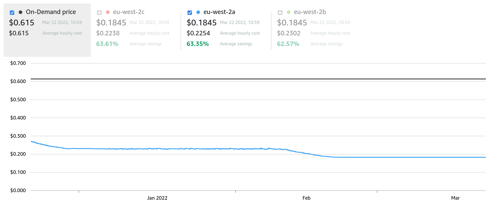

Example: Nextflow pipeline with AWS Batch for HPC-like jobs
- Automatically creates/deletes as many nodes as you want can afford
- Potentially an efficient way to manage GPU spend, especially with spot instances

---
<!--
_class: title
_footer: ''
-->
# Challenges we've faced

---

# Managing Costs
- Understanding shared overheads: small number of large projects vs large number of small projects
- Non constant interactive workloads (e.g. "office" hours) so savings plans don't work
- Each project has different compute requirements, sustained workloads tend to be short term so reserved instances won't work
- Cloud resilience vs cost: full redundancy is expensive

---
<!-- _footer: '' -->
## Lots of cost visualisation dashboards available

⬅️ Microsoft Teams bot that tells us how much we've spent each day

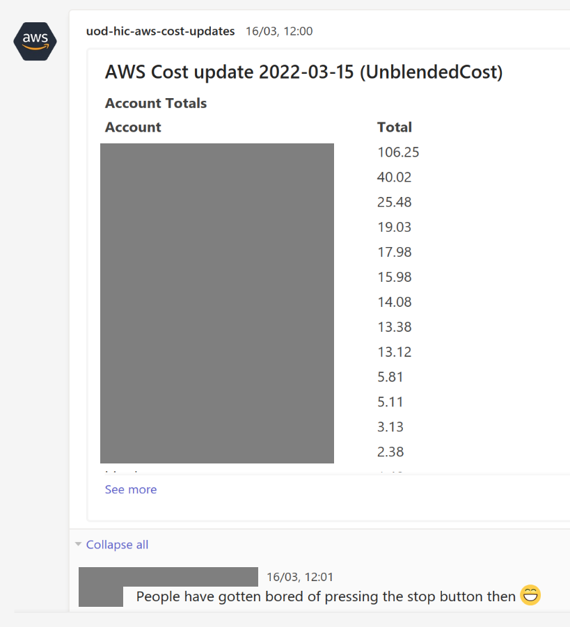

---
# How do we charge researchers?

On-prem: flat rate for most researchers

Cloud:
- Unfair to charge basic desktop user the same as a deep-learning GPU user
- Pay-as-you-go requires researchers to understand the costs
- Also need to cover staff overheads

---

# Cloud paradigms: Cattle vs Pets

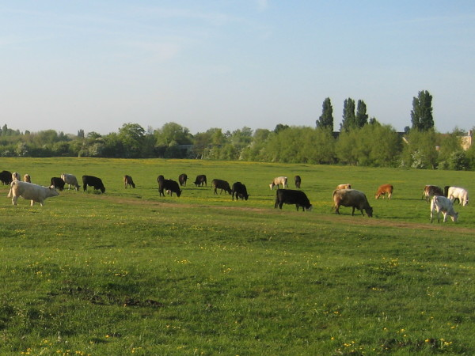

Cattle: everything is replaceable and automated. Ideal for reproducible research.

Pets: researchers individually connect to a VM on and off over several months, expect it to stay around. One size doesn't fit all.

---
# Licensing
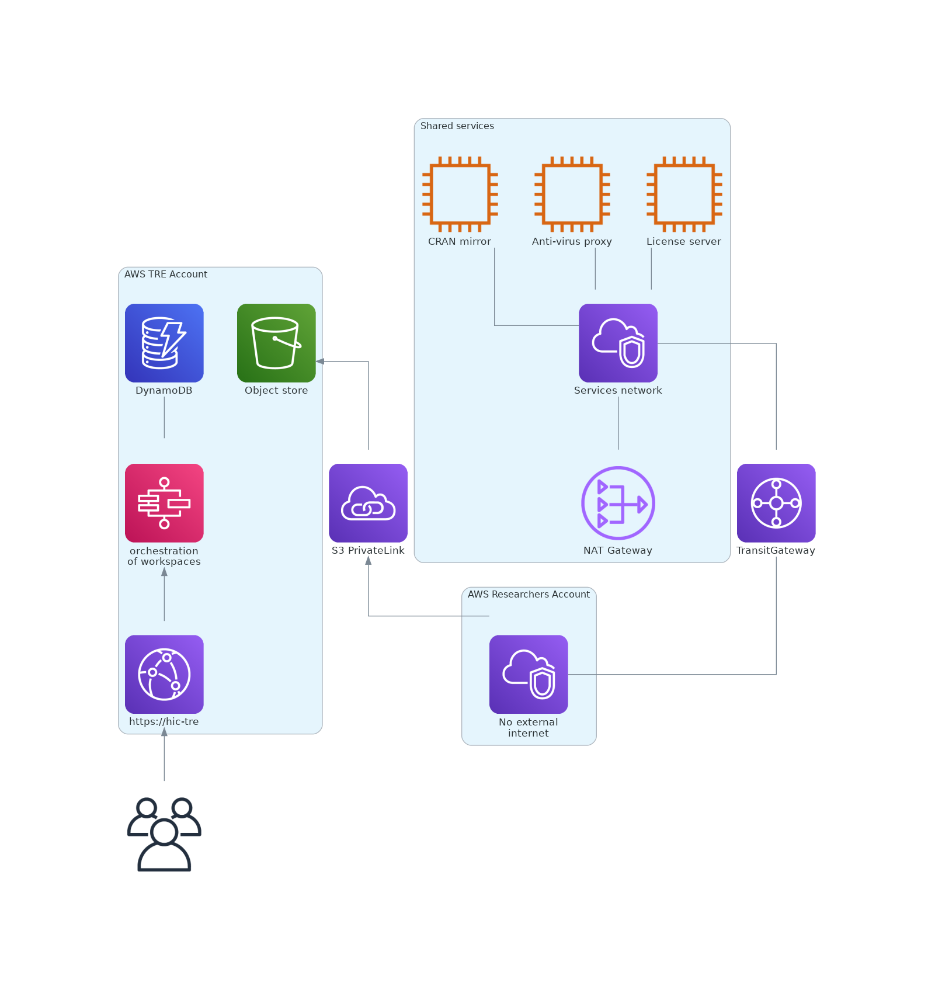

Open-source: easy!

Commercial: A problem when software requires a fixed host/MAC identifier, or external activation per instance

- MatLab: we run our own license server in the TRE (bridged to outside network)
- Microsoft Office: not yet working

---
# When will it be available?

July 2022

---
<!--
_footer: ''
_paginate: false
-->

# Acknowledgements

### HIC project leads
Chris Cole
Emily Jefferson

### HIC infrastructure Team
Kenny Gillen
Aaron Jackson
Slawek Lezala

### AWS
Phil Edwards
Brian Nelson
Multiple other AWS teams

### Multiple other HIC and AWS teams

