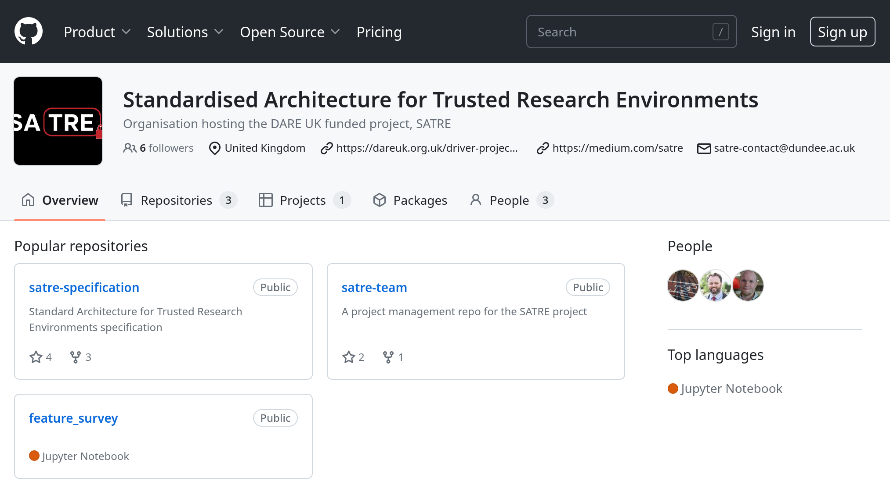

<!--
_class: title
_footer: ''
-->

# Migrating secure research platforms to the cloud- how can this improve scientific collaborations in the UK?

## AWS NE Scotland user group meeting 24 May 2023 Simon Li Health Informatics Centre, University of Dundee

###  [@manics](https://github.com/manics)   [@penguinoops@hachyderm.io](https://hachyderm.io/@penguinoops)

---
# Who am I?

Research {infrastructure/software} {engineer/specialist} at the **Health Informatics Centre**, University of Dundee

<small>Also open-source contributor to JupyterHub and other random projects. Previously worked for the Open Microscopy Environment.
</small>

---
# The Health Informatics Centre

The vision:

> To advance data science and its community, simplifying access to sensitive data whilst maintaining security as a global leader in open, reproducible and scalable research platforms

https://www.dundee.ac.uk/hic

---
<!--
_class: title
_footer: ''
-->

# 1. Trusted Research Environments and Secure Research: What/Why/How
# 2. Running a TRE on AWS
# 3. Improving secure research in the UK

---
<!-- What is a TRE? -->

# Trusted Research Environments

Also called Data Safe Haven, Secure Data Environments, ....

A secure restricted environment where researchers can work with sensitive data

---
# Example: Can undiagnosed heart failure be detected from routine medical records?

Required data:
- echocardiograms - heart imaging scans
- electronic health records - medical diagnoses, prescription records, going back several years

---

## 1. What data is available?

Obtain health records by querying multiple databases
- sensitive patient data, very few people have access to it
- This is *not* made available to researchers, it's reduced to *only* what's required for an analysis (partial records), and it's *pseudonymised*

 [HicServices/RDMP](https://github.com/HicServices/RDMP)

---
## 2. Pseudonymisation of data

Identifying information is removed from records
- True anonymisation is almost impossible: ***pseudonymised data***
- Original information might be recoverable by cross-referencing with another dataset.

---
## 3. Data made available to researchers in TRE

Highly restricted compute environment:
- Prevents re-identification through cross-linking with other datasets
- Ensures sensitive data isn't copied out

---
## 4. Researchers analyse data

Do past medical records contain information that can predict future heart failure?

---
## 5. Researchers publish results

Analysis results are manually reviewed for potentially identifying information before they can are released from the TRE

---
# Basic principles of a TRE: The 5 safes

**Safe data**: data is treated to protect any confidentiality concerns.
**Safe projects**: research projects are approved by data owners for the public good.
**Safe people**: researchers are trained and authorised to use data safely.
**Safe settings**: a secure environment prevents unauthorised use.
**Safe outputs**: screened and approved outputs that are non-disclosive.

*https://ukdataservice.ac.uk/help/secure-lab/what-is-the-five-safes-framework/*

---
<!-- The HIC-TRE -->

<!-- _footer: '' -->
# Who uses our TRE?
A very wide range of users requiring a full compute environment
- non-technical users working with Windows desktop applications
- technical developers with knowledge of using cloud infrastructure

---
<!--
_footer: 'https://github.com/HicResearch/TREEHOOSE'
-->

# Architecture

---
# The Frontend

<!--
- Login with Cognito/Keycloak
- React frontend, accessed via CloudFront
- All state in DynamoDB
- Logic for managing data and workspace access handled with AWS Lambda and step functions
- Workspaces are Cloudformation stacks, created/deleted
- IAM policies updated on demand for each user/workspace
-->
---
# What does a researcher see?
- The pseudonymised dataset(s) they've been authorised to see, mounted as a local filesystem
- Software packages for analysis
- A virtual desktop environment accessed via a web browser

---
- Storage is in one AWS account, separated by "project"
- Researcher workspaces in a separate AWS account
- Virtual display restricts copy/paste, web-browser is the only interface
- No cross-over of user data between projects

---
# What is restricted?
- No external internet (with limited exceptions)
- No connection to resources belonging to other projects
- Can't copy files out
- Can't copy out via the clipboard (we allow pasting text in though)

These all assume a "safe" approved researcher.

---

# Screenshots...
## or even a live demo...

---
<!-- _footer: '' -->

---
<!-- _footer: '' -->

---
<!-- _footer: '' -->

---
<!-- _footer: '' -->

---
<!--
_class: title
_footer: ''
-->
# The good and bad of running a TRE on AWS

---
## Problems with running a TRE in AWS: Cost!

- Deciding between enterprise managed services vs building our own E.g. Network Firewall
- Redundancy and scaleability vs overheads

---
## How do we charge researchers?

On-prem: flat rate for most researchers

Cloud:
- Unfair to charge basic desktop user the same as a deep-learning GPU user
- Pay-as-you-go requires researchers to understand the costs

---

## Cloud paradigms: Cattle vs Pets

Everything is replaceable and automated. Ideal for reproducible research.

Researchers individually connect to a VM on and off over several months, expect it to stay around. One size doesn't fit all.

---
## Significant benefits

- Hardware isn't our problem
- Never run out of storage or compute
- Completely secure custom compute infrastructures

---
<!--
_class: title
_footer: ''
-->

# The biggest benefit: going beyond Dundee

---
<!--
_footer: https://unesdoc.unesco.org/ark:/48223/pf0000379949.locale=en
-->

> various movements and practices aiming to make multilingual scientific knowledge openly available, accessible and reusable for everyone, to increase scientific collaborations and sharing of information for the benefits of science and society, and to open the processes of scientific knowledge creation, evaluation and communication to societal actors beyond the traditional scientific community.

---

# TREs: going beyond dundee

- TREs are generally very siloed in the UK, almost every TRE is a bespoke solution
- Several recent influential reports seek to change the UK's strategy on secure research
  - Goldacre Review
  - DARE report
  - NHS data saves lives

---
<!--
_footer: https://www.gov.uk/government/publications/better-broader-safer-using-health-data-for-research-and-analysis
-->

# [185 recommendations](https://www.gov.uk/government/publications/better-broader-safer-using-health-data-for-research-and-analysis)

## Chapter 1: Modernising NHS Service Analytics

Professional Structures

- NHSA 1. Create an NHS analyst service modelled on GES, GSS, GORS
- NHSA 2. Create clear job descriptions for NHS analysts at a range of levels
- NHSA 3. Revise Agenda for Change, and ensure technical staff are paid realistic salaries
- NHSA 4. Support an NHS analyst community
- NHSA 5. Develop an annual data conference for NHS service analysts
- NHSA 6. Find good staff, and empower them quickly with ‘data pioneer’ fellowships
- NHSA 7. Identify 3 ‘data pioneer’ analytics teams in ICSs and trusts
- NHSA 8. Commission intermittent code and analysis audits of organisations and analyst teams for service improvement
- NHSA 9. Create an Analytical Capability Index

Training

- NHSA 10. Create an Open College for NHS Service Analysts
- NHSA 11. Devise the content of a national training programme for NHS analysts: initial and CPD
- NHSA 12. Oversee funding and delivery of training, both open online and one-to-one
- NHSA 13. Establish new core training for analysts
- NHSA 14. Outline clear, non-onerous CPD training requirements for analysts
- NHSA 15. Embrace RAP and modern, open working methods
- NHSA 16. Ensure training focuses on RAP as much as Machine Learning
- NHSA 17. Create a technical team to house and develop continuing professional development resources
- NHSA 18. Ensure all training is open by default
- NHSA 19. Create and maintain a curated national open library of NHS analyst code
- NHSA 20. Create training specifically for senior leaders to help them become better customers for data analysis
- NHSA 21. Commission a rapid review of medical school curricula and similar

Platforms and data access

- NHSA 22. Improve the provision of data analysis environments
- NHSA 23. Revise NHS IT policy for analysts to ensure it is fit for purpose
- NHSA 24. Rationalise national audits, RightCare, GIRFT, and Model Health System
- NHSA 25. Make change practical

External collaborations

- NHSA 26. Commission and promote best practice on outsourcing analytics
- NHSA 27. Require all outsourced or external work to comply with RAP and open working methods
- NHSA 28. Support NHS/academic collaborations on RAP data science for NHS service improvement

## Chapter 2: Open Working

Establish clear expectations around RAP and open code for the whole system

- Open 1. Create a RAP and Open Code Oversight Group
- Open 2. Create a public policy setting out expectations on open code
- Open 3. Make open code a boilerplate feature of all public contracts
- Open 4. Create an ‘exceptions framework’ whereby publicly funded code can be closed by prior arrangement if this meets NHS and UKplc strategic objectives
- Open 5. Create an Open Code Ombudsman and Assistance Unit
- Open 6. Assert that publicly funded code is publicly owned: cautiously consider ‘Crown Copyright for code’
- Open 7. Data Controllers should require RAP and open code sharing from data users
- Open 8. Amend the Code of Practice for the Research Powers of the Digital Economy Act
- Open 9. Make it ‘okay to ask’ about access to publicly funded code

Develop Guidance on Open Code from Specific Key Organisations

- Open 10. Health and Care Information Governance Panel guidance should facilitate open code
- Open 11. The Information Commissioner’s Office should produce guidance to facilitate code sharing
- Open 12. The Medicines and Healthcare products Regulatory Agency should address code sharing and device regulation
- Open 13. Negotiate co-ownership of claimed commercial innovations from NHS data

Support NHS service analysts to work with RAP and open methods

- Open 14. Write an ‘open analytics policy for the NHS’
- Open 15. Make open a standard contractual requirement
- Open 16. Commission intermittent open code audits to drive improvement
- Open 17. Establish a technical writing and documentation team for the NHS

Build workforce capacity for RAP and modern, open, collaborative working

- Open 18. Create a ‘Code For Health’ training programme for NHS service analysts and academic researchers

Combine NHS and academia
MOOCs and practical work
Build on prior work but maintain focus on RAP
Open competitive procurement

- Open 19. Create a ‘Data for NHS leaders’ training programme
- Open 20. Create an ‘NHS data for developers and data scientists’ training programme

Make code a central feature of work in universities using health data

- Open 21. Modify the Research Excellence Framework (REF) to reflect computational work
- Open 22. Embrace research software engineering (RSE) in health data work
- Open 23. Pay realistic salaries to software developers
- Open 24. Create a working group to develop an attribution model for code and data
- Open 25. Clarify the need for authorship for software developers and data scientists as equal core contributors
- Open 26. Proactively address sharing during the pandemic
- Open 27. Academic journals should be encouraged to make code-sharing a requirement
- Open 28. Embrace research software engineering with 3 data pioneer groups leading by example
- Open 29. Use research funding to drive modernisation around better use of code and data
- Open 30. Make code sharing a core feature of all standard funding contacts
- Open 31. Provide guidance and training on RAP and code sharing

Fellowships for software developers in health data
Entry fellowships scheme for developers from other sectors
Training fellowships in computational methods

- Open 33. Open funding calls for projects and programmes around Code for Health Data.
- Open 34. Treat ‘data Infrastructure’ as open code
- Open 35. Use open competitive funding for code projects
- Open 36. Review prior delivery of open code by applicants
- Open 37. Ensure experts on code select and oversee code projects
- Open 38. Ensure the objectives and outputs of all investments are open
- Open 39. Ensure funding for code and platforms does not get diverted
- Open 40. Avoid ‘regressive funding models’ built around short-term bursts of funding
- Open 41. Focus on sustainability for software projects: set aside a third of resource for this task

Encourage open working through Trusted Research Environment design and implementation

- Open 42. All Trusted Research Environments for NHS data must facilitate and require code sharing
- Open 43. TREs themselves should be built on principles of RAP and open code
- Open 44. Produce clear guidance on disclosure risk and open code

## Chapter 3: Privacy and Security

There is no new emergency, but TREs should be used, and data dissemination should not expand
UKRI/NIHR should resource applied methods research into privacy preservation
Revise the definitions of “anonymous” “identifiable” and “linked” data; add a new category of “pseudonymised but re-identifiable”

## Chapter 4: Trusted Research Environments

National TREs
Local TREs
Academic TREs

Delivering a national TRE programme

- TRE 1. Create the role of national lead on NHS TREs and data curation
- TRE 2. Rapidly create a substantial multidisciplinary TRE technical delivery team
- TRE 3. Rapidly agree and publish features for the minimum viable National TRE
- TRE 4. Agree and publish proposed features of the full National TRE
- TRE 5. Produce a minimum viable TRE in 6 months
- TRE 6. Rapidly scale over 18 months
- TRE 7. Include GP data and certain commonly used national datasets from the start
- TRE 8. Expand the National TRE in time to accept bespoke datasets
- TRE 9. Evaluate new developments in privacy engineering; adapt accordingly
- TRE 10. All TREs must support code sharing and RAP

Develop Trustworthy, Agile, Standard Governance for National NHS TREs

- TRE 11. Build a TRE governance team to create a robust framework around TRE access
- TRE 12. Create a single standard service wrapper model for NHS TREs
- TRE 13. Create a national standard approach to “output checking” and support automation
- TRE 14. Establish a standard scheme to accredit NHS TRE users
- TRE 15. Ensure TRE access is faster and easier than data dissemination
- TRE 16. All TREs must share live detailed activity logs
- TRE 17. Create clear rules for undeclared analyses in TREs
- TRE 18. Switch off data disseminations, without undue panic
- TRE 19. Conduct an annual access audit
- TRE 20. Publish all technical steps taken to prevent and detect misuse of data

Ensuring National TREs are Accessible, and Used

- TRE 21. The National TRE should be open to all legitimate users
- TRE 22. No special cases for working outside a TRE
- TRE 23. Ideally one national TRE, never more than 3

Local NHS TRE provision

- TRE 24. Create a local NHS TRE programme
- TRE 25. Work to rapidly standardise local TRE and DAE provision, starting with ICSs
- TRE 26. Create a single service wrapper model for local NHS TREs
- TRE 27. Ensure all ICSs use a standard TRE approach
- TRE 28. Ensure any other local NHS TREs use the same standard TRE approach
- TRE 29. Manage diverse local datasets by creating and sharing standard data curation tools and methods
- TRE 30. Ensure all local implementations of national or commonly used datasets such as SUS/HES conform to a single standard
- TRE 31. Ensure all datasets extracted from national datasets in NHS Digital are requested using standard data management code
- TRE 32. Work towards federated analytics with standard local TREs
- TRE 33. Ensure local analysts use a national TRE wherever possible
- TRE 34. NHS Trusts and Data Access Environments
- TRE 35. Listen carefully to local NHS analysts and TRE managers who describe shortcomings in standard approaches and address these wherever possible

TREs for national audits and registries

- TRE 36. Use the same TRE approach as above
- TRE 37. Start with data pioneers who can demonstrate computational maturity
- TRE 38. Review the current registry and audit landscape; work towards wider access and use
- TRE 39. Work towards audits and registries using national NHS infrastructure, RAP, and TREs

Academic TRE implementation

- TRE 40. Academics should use NHS data infrastructure to access NHS patient records
- TRE 41. Academic TREs should use standard NHS TRE Service Wrapper and governance
- TRE 42. Academic TREs should use standard NHS TRE and curation approaches where possible
- TRE 43. All academic TREs should aim to use shared standard infrastructure
- TRE 44. All academic TREs must support, and should require, RAP and open working
- TRE 45. Start with data pioneers who can demonstrate computational maturity in research cohorts

Academic TRE funding

- TRE 46. All funding for academic work on TREs should pass through a single national organisation
- TRE 47. All TRE and related funding should be openly disclosed
- TRE 48. There should be follow-up on all TRE projects resourced
- TRE 49. Academic work around TREs should be funded through conventional open competition
- TRE 50. Funders should avoid short-term funding for infrastructure
- TRE 51. Funding for TREs should be separate to funding for single academic analyses
- TRE 52. All best practice and teams should be identified and augmented
- TRE 53. An overview of prior investments

What to fund

- TRE 54. Standard, national, shared, core compute infrastructure
- TRE 55. TRE infrastructure as code and teams

Methodological innovation and code for automated data release from TREs
Methodological innovation and code for data minimisation
Methodological innovation and code for detection of data misuse
Methodological innovation and code to detect unwarranted variation in care
Methodological innovation and code for federated analytics

- TRE 56. Exceptions to TRE usage

Consented cohorts
Clinical trials

- TRE 57. Address TREs for Artificial Intelligence, but as a separate workstream, funded by existing AI resource

Objections to TREs

## Chapter 5: Information Governance, Ethics and Participation

Enhanced usability for IG and ethics processes

- IG 1. Create a single form for all ethics, IG, and other data access permissions
- IG 2. Streamline the number of approvals meetings
- IG 3. Get researchers in the room
- IG 4. Create an arbitrator for disagreements over specific access requests
- IG 5. Create a single map of all approvals
- IG 6. Provide rapid unambiguous guidance when approval is not required
- IG 7. Establish 2 modest Centres for Regulatory Science
- IG 8. Establish a clinic to help users who are blocked on data access

Two-track approval for TREs

- IG 9. Create a 2-track approval system to incentivise use of TREs
- IG 10. Maintain excellent standards around governance issues not addressed by TREs
- IG 11. Review the National Data Opt Out Policy after TREs are established
- IG 12. Uphold the commitment that the NHS Digital GPDPR dataset will not be disseminated

Regulation and Legislation

- IG 13. Revise the definitions of ‘anonymous’, ‘dentifiable’ and ‘linked’ data; add a new category of ‘pseudonymised but re-identifiable’
- IG 14. Consider including health data in the Digital Economy Act
- IG 15. Appropriately sanction those who are caught deliberately and maliciously attempting to re-identify individuals in patient records
- IG 16. Disclose all data flows leaving NHS organisations in one place
- IG 17. Create a central repository of DPIAs, DSAs and related documents for local NHS data flows
- IG 18. Produce boiler-plate templates for patient consent for data use and dissemination
- IG 19. Simplify the rules governing use of posthumous data
- IG 20. Address the ‘multiple permissions’ problem

Addressing specific roles and uses

- IG 21. Start an overdue public and professional discussion on performance management
- IG 22. Ensure DHSC can access data when appropriate
- IG 23. Start an overdue public discussion about commercial access
- IG 24. Negotiate co-ownership of claimed commercial innovations from NHS data
- IG 25. Address exclusive commercial arrangements

Patient and Public Involvement and Engagement

- IG 26. Ensure PPIE expectations are proportionate to the sensitivity and scale of the project.
- IG 27. Provide researchers with easy access to practical guidance, and examples of best-practice
- IG 28. Resource and give a platform to experts in building public understanding.
- IG 29. Consider centrally commissioning PPIE on common causes of concern

## Chapter 6: Data Curation

- Cur 1. Adopt the principles of RAP
- Cur 2. Set up an NHS Data Curation planning and delivery team, or similar, to own the challenge
- Cur 3. Produce and maintain an open public library of data curation code

Generate NHS data curation code, and surface existing work

- Cur 4. Mandate that all publicly funded data curation code is shared openly
- Cur 5. Identify 5 data pioneer teams to adopt open curation methods
- Cur 6. Ensure national programmes lead by example
- Cur 7. Capture, and openly share, existing curation knowledge around commonly used national datasets
- Cur 8. Use consistent environments to facilitate re-usable curation code
- Cur 9. Require use of national TREs for tasks using national datasets wherever possible
- Cur 10. Create and enforce consistent standards for local implementations of national datasets
- Cur 11. Create and enforce standards for local TREs

Develop tools to facilitate re-usable curation code

- Cur 12. Develop standard tools to convert raw data into analysis-ready datasets
- Cur 13. Develop portable representations of data management code
- Cur 15. Insist that all dataset requests are made in code

Develop capability in Clinical Informatics

- Cur 16. Ensure there is clinical informatics training on medical school, post-graduate, and other clinical curricula
- Cur 17. Ensure universities have core capacity in clinical informatics
- Cur 18. Support core capacity in clinical informatics

## Chapter 7: Strategy

Use people with technical skills to manage complex technical problems

---
# Key aims:

- Open/shared infrastructure
- Reduced duplication of effort
- Transparency with the public

---

# How do cloud providers help with this transition?

## (Apart from than the obvious)

Provides a common infrastructure platform accessible to anyone

- Three big providers, but that's better than 1000s of independent datacentres

---

# TREEHOOSE

### Trusted Research Environment and Enclave for Hosting Open Original Science Exploration

An open-source TRE developed in conjunction with AWS (it's important in academic research to have a good acronym)

---

- Open-source: Multiple organisations share maintenance and development
- If every TRE on AWS uses the same infrastructure we can start to share data or analyses across TREs subject to Governance, something that's almost impossible

---
But that's not enough, not everyone wants to use AWS

So we're part of an even bigger project, aiming to standardise all TREs in the UK (and maybe beyond?)

---
<!--
_footer: 'https://www.hdruk.ac.uk/wp-content/uploads/2021/04/Goldacre-Review-TRE-Response.pdf'
-->

---
# SATRE

Open-standards for TREs

---
<!--
_footer: ''
_paginate: false
-->

