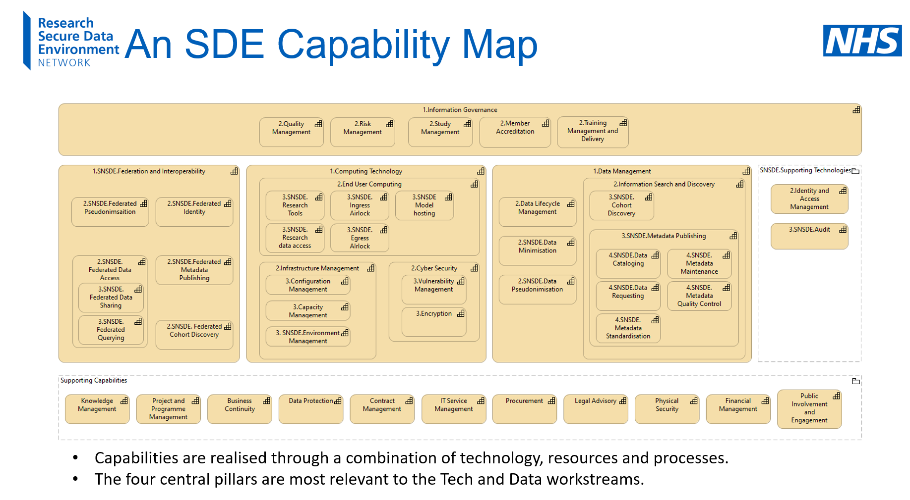
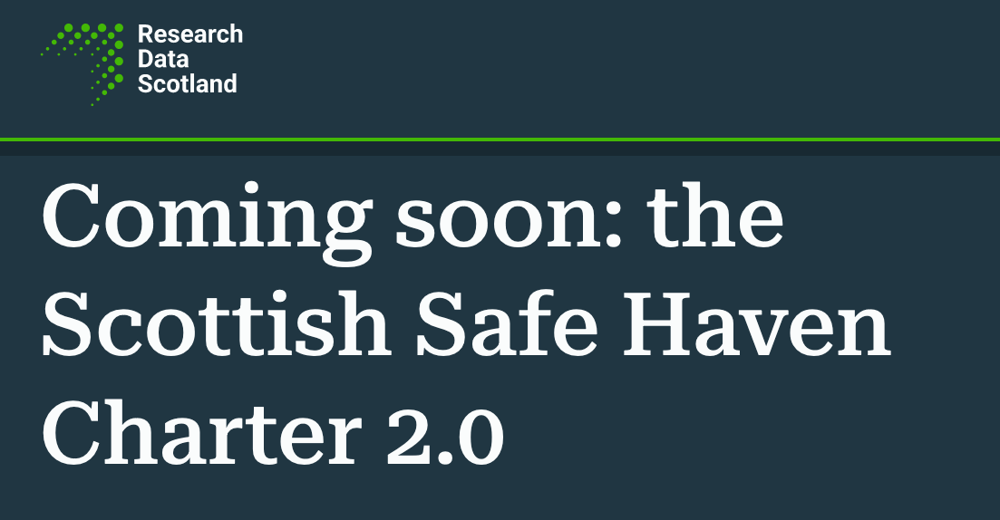
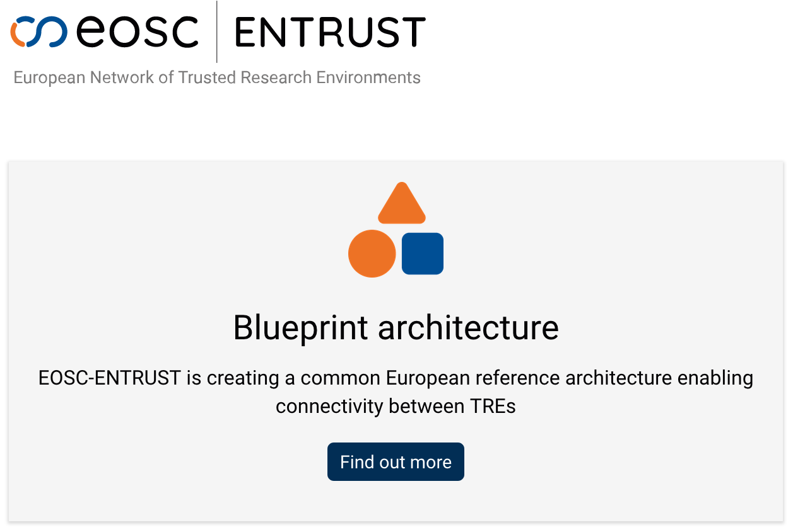
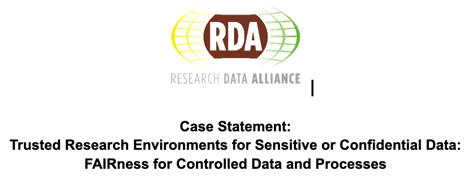
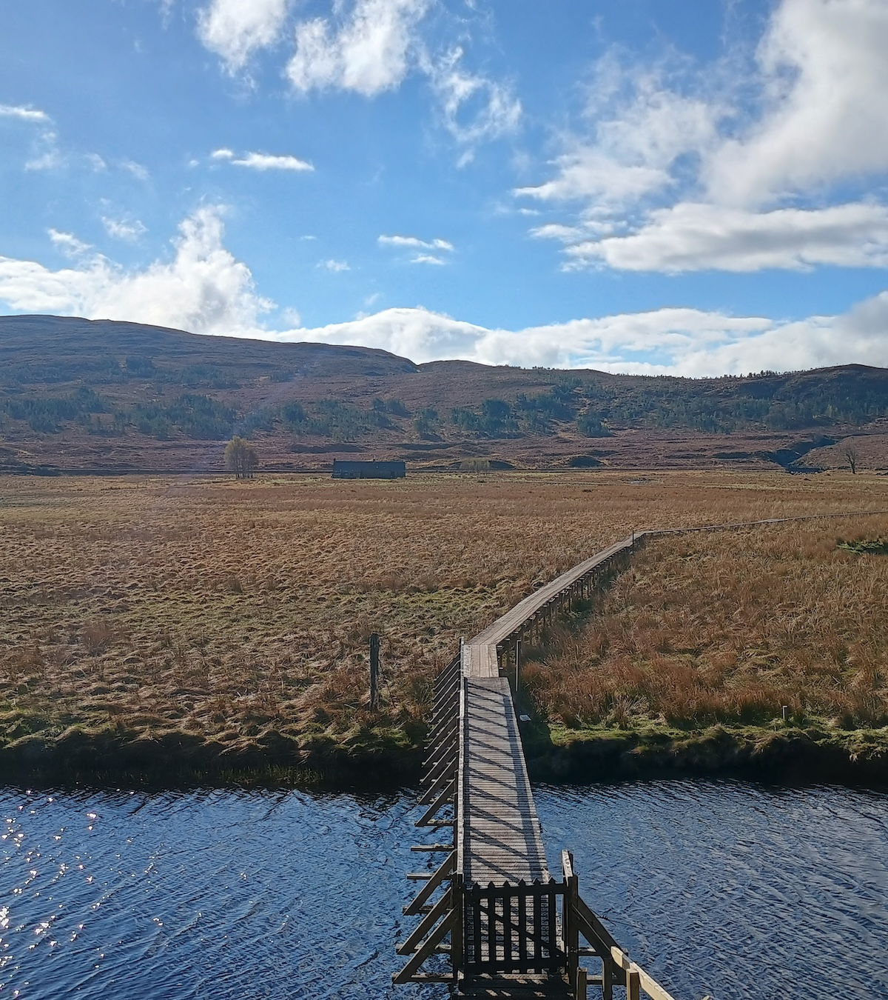

<!-- _class: title -->
<!-- _backgroundColor: #05033f -->

# UKTRE Working Group: SATRE (Standardised Architecture for Trusted Research Environments)

## 29 April 2024 satre-contact@dundee.ac.uk

---

# 2022: The problem:

100s(?) of TREs in the UK
- Every TRE is different
- No best practice on how to design, operate and use a TRE

---

# 2023: DARE funded pilot project

- UK TRE provided a ready-to-go community to develop a TRE standard
- Would've been impossible to do in a year without the community

---

# 2024: SATRE taken up by multi-institution bodies

---

# What will this working group do?

To be decided as we work on the charter 😀, but likely:

**SATRE version 2**: We know the architecture isn't complete

**TRE evaluations**: Showcase evaluations, and help TREs to evaluate themselves

**Governance of SATRE**: We need a long-term governance/control model for SATRE, especially given the uptake it's received

**Investigate how to become a formal standard**: Many people have asked for it, is it feasible?

---

# Challenges we'll face

- Ownership vs fragmentation
- Enabling SATRE evaluations for commercially sensitive TREs
- Overhead/cost of becoming a formal standard

