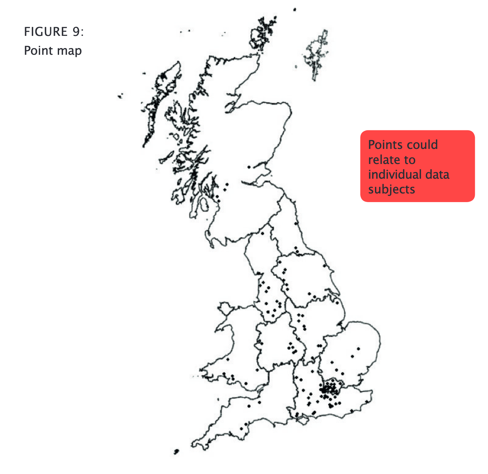
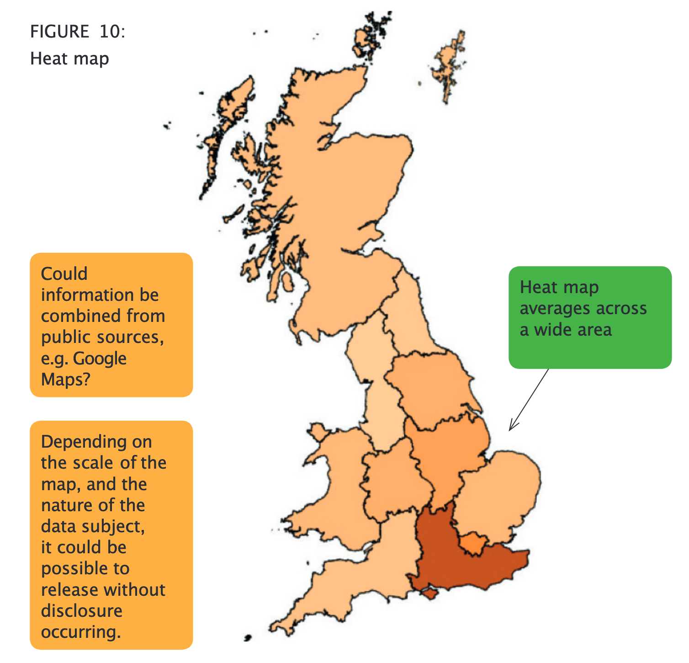
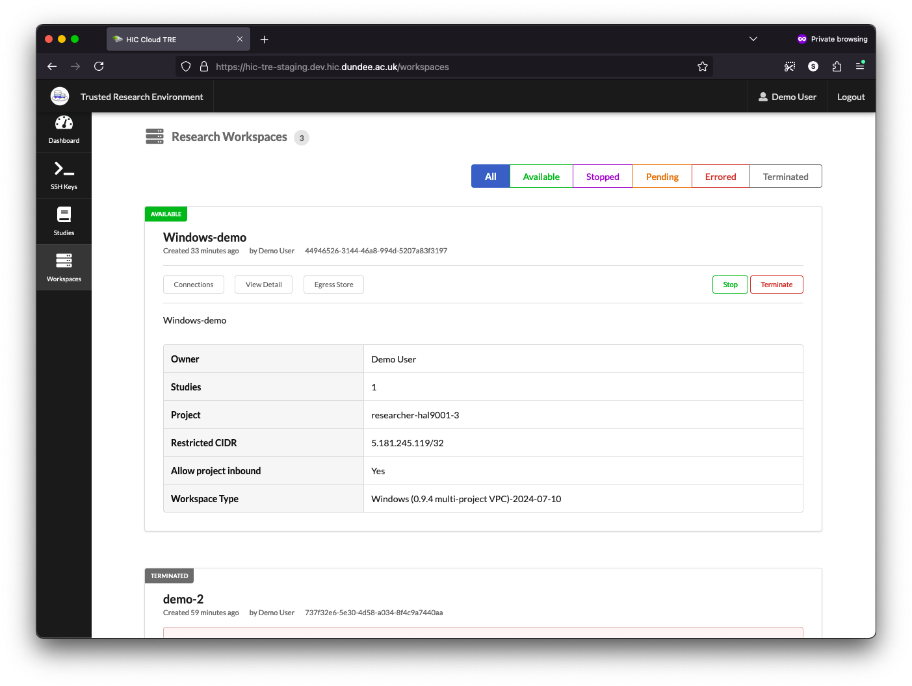
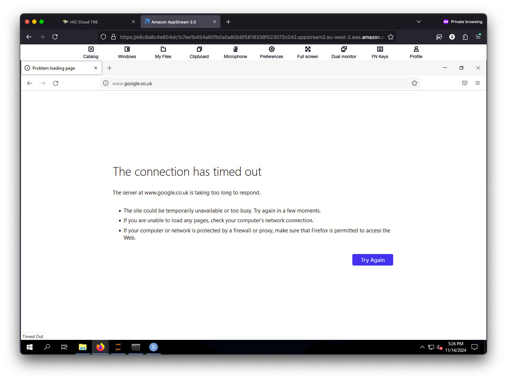
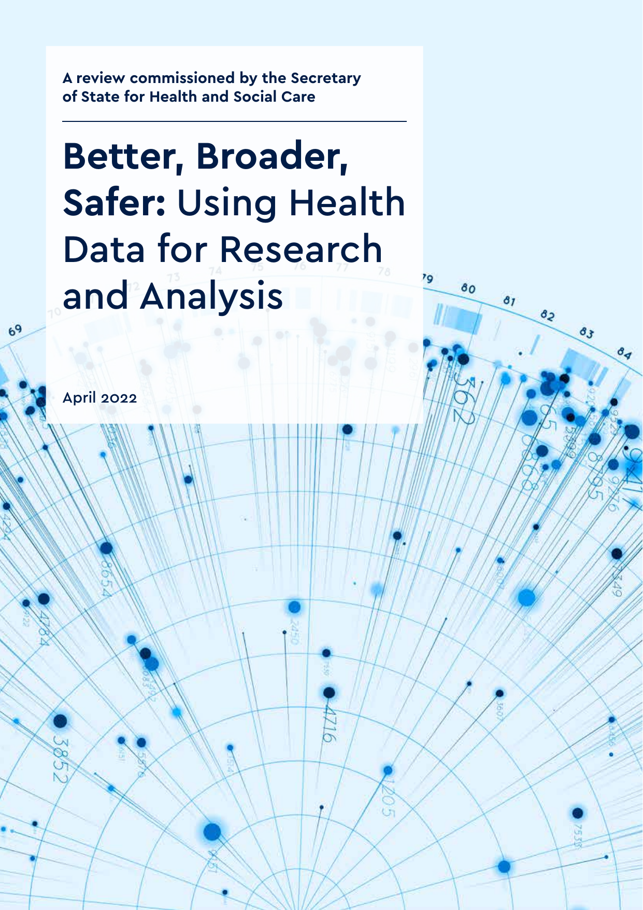

<!--
_class: title
_footer: ''
-->

# Open science and Trusted Research Environments

## Dundee Data Meetup 26 November 2024 Simon Li

###  [@manics](https://github.com/manics)   [@penguinoops.bsky.social](https://bsky.app/profile/penguinoops.bsky.social)

---
# Who am I?

Research infrastructure engineer at the **Health Informatics Centre**, University of Dundee

<small>Also open-source contributor to [JupyterHub](https://hub.jupyter.org/) and other random projects. Previously worked for the [Open Microscopy Environment](https://www.openmicroscopy.org/).
</small>

---
# The Health Informatics Centre

The vision:

> To advance data science and its community, simplifying access to sensitive data whilst maintaining security as a global leader in open, reproducible and scalable research platforms

https://www.dundee.ac.uk/hic

---
# Overview

1. Trusted Research Environments: what are they, why do we need them?
2. Open science: The relevance of open science to TREs
3. What do the public think?

---

# Trusted Research Environments

What are they? Secure workspaces where you can analyse sensitive data with minimal risk of data being leaked.

---
# Sensitive data?
E.g. Personal data, names/addresses, healthcare records, financial statements, commercial secrets, raw census data.

I'll mostly talk about healthcare data (**H**IC)

---
<!--
_footer: https://ico.org.uk/for-organisations/uk-gdpr-guidance-and-resources/lawful-basis/a-guide-to-lawful-basis/lawful-basis-for-processing/special-category-data/
-->
## Sensitive or "Special category" data

> - personal data revealing racial or ethnic origin
> - personal data revealing political opinions
> - personal data revealing religious or philosophical beliefs
> - personal data revealing trade union membership
> - genetic data
> - biometric data (where used for identification purposes)
> - data concerning health
> - data concerning a person’s sex life
> - data concerning a person’s sexual orientation

---
# Example: Can undiagnosed heart failure be detected from routine medical records?

<!-- Risk detected by AI in pioneering study -->

_Artificial Intelligence has the capability to detect people living with the risk of experiencing heart failure, new University of Dundee research has discovered._

https://www.dundee.ac.uk/stories/heart-failure-risk-detected-ai-pioneering-study

<!--
Heart failure: heart is unable to pump blood around the body effectively, gets worse over time
-->

---

<!--
Echocardiography heart scans from heart failure patients
Electronic health records to identify heart failure patients with echocardiograms
AI used to extract measurements of hearts from echocardiograms, better than usual methods
Combined with test results from medical records

Patients from Scottish Health Research Register and Biobank (SHARE)
-->

---
# A very rough workflow

---
## 1: Obtain approval and funding for the research project

---
## 2. What raw data do we have?

Sensitive patient data, very few people have access to it.

- Echocardiograms (heart imaging scans), and other medical imaging
- Electronic health records across possibly multiple databases- medical diagnoses, prescription records, going back several years

Researchers ***never*** have access to this data.

---
## 3. Extraction and Pseudonymisation of data

Data minimisation: only extract a subset of records and fields

Identifying information is removed from records
- True anonymisation is almost impossible: ***pseudonymised data***
- Original information might be recoverable by cross-referencing with another dataset.

Pseudonymised data can still be classed as personal data.

---
## 4. Data made available to researchers in TRE

Highly restricted compute environment:
- Prevents re-identification through cross-linking with other datasets
- Ensures sensitive data isn't copied out
- No worries about laptops being left on a train

---
## 5. Researchers analyse data

Do past medical records contain information that can predict future heart failure?

---
## 6. Researchers publish results

Analysis results are reviewed for potentially identifying information before they can are released from the TRE

## → Statistical disclosure control

> confidentiality of individuals and individual statistical units must be protected

---
<!--
_footer: https://securedatagroup.org/wp-content/uploads/2019/10/sdc-handbook-v1.0.pdf
-->

---
# How do you design a TRE?

---
# Basic principles of a TRE: The 5 safes

**Safe data**: data is treated to protect any confidentiality concerns.
**Safe projects**: research projects are approved by data owners for the public good.
**Safe people**: researchers are trained and authorised to use data safely.
**Safe settings**: a secure environment prevents unauthorised use.
**Safe outputs**: screened and approved outputs that are non-disclosive.

*https://ukdataservice.ac.uk/help/secure-lab/what-is-the-five-safes-framework/*

---

---
## Balancing the 5 safes

No such thing as 100% secure, need a balance between the 5 safes. Different TREs can make different tradeoffs, e.g.
- Access via a browser from anywhere
- vs must be physically present in a ["SafePod"](https://safepodnetwork.ac.uk/)

---
# What does a TRE look like?

---
<!-- _footer: '' -->

---
<!-- _footer: '' -->

---
<!-- _footer: '' -->

---
<!-- _footer: '' -->

---
<!-- _footer: '' -->

---
<!-- _footer: '' -->

---
<!-- _footer: '' -->

---
<!-- _footer: '' -->

---
<!-- _footer: '' -->

---
<!--
_footer: ''
-->
<!-- https://www.vectorlogo.zone/?q=visual -->

Full desktop environment, with many of the usual analysis applications

- Focus on the analysis, not on how to manage the data

---
Downsides: Very restrictive environment compare to what you're used to
- No or very limited outbound network access
- Can't install random software packages
- Clipboard is restricted (can't copy out)

---
# Open Science: what is it?

Scientific research should be freely accessible to everyone

---
<!--
_footer: https://unesdoc.unesco.org/ark:/48223/pf0000379949.locale=en
-->

> various movements and practices aiming to make multilingual scientific knowledge openly available, accessible and reusable for everyone, to increase scientific collaborations and sharing of information for the benefits of science and society, and to open the processes of scientific knowledge creation, evaluation and communication to societal actors beyond the traditional scientific community.

---
# Open-science in TREs

❌ Open data

✅ Open access: share your results
✅ Open source: share your code and analyses

✅ Open infrastructure: show others how to run infrastructure to support science
✅ Open collaboration: share your knowledge and help others

---
# The problem

100s(?) of TREs in the UK
- Every TRE is different
- No best practice on how to design, operate and use a TRE

# Part of the solution....

---
# Open infrastructure: open-source isn't enough

Running a single application is easy, but how do you deploy and run an entire TRE?
- Share your deployment code and documentation

---
# Federated analysis

Data is currently siloed in different TREs
 - We need standards for interoperability!

---
<!--
_class: overlaybg
-->

# Open collaboration

---
# Standard Architecture for Trusted Research Environments

Can we make sure all new TREs work in a similar way?

https://satre-specification.readthedocs.io/

---
# What do the public think?

- A cautionary note

---
# 2014: Care.data

https://www.bmj.com/content/354/bmj.i3907
> By now, if all had gone to plan, England would be reaping the early benefits of a national database of patients’ medical records spanning primary and secondary care. Patients would have the comfort of knowing that their records could soon be accessed wherever they were treated....

---

> But all did not go to plan. NHS England’s care.data programme failed to win the public’s trust and lost the battle for doctors’ support. Two reports have now condemned the scheme, and last week the government decided to scrap it.

# Public trust is really important!

## The NHS has learnt from that

---
# "People in the UK overwhelmingly support the use of their health data, with appropriate safeguards, to benefit themselves and others."

TREs and open-science have a big part to play

---

# Bedtime reading

Trusted Research Environments
- https://www.dundee.ac.uk/hic/safe-haven
- https://satre-specification.readthedocs.io
- https://dareuk.org.uk

Public views on sensitive data
- https://www.pedri.org.uk
- https://understandingpatientdata.org.uk

Important reports
- https://www.hdruk.ac.uk/helping-with-health-data/the-sudlow-review/
- https://www.gov.uk/government/publications/better-broader-safer-using-health-data-for-research-and-analysis

Scottish Health Research Register and Biobank (SHARE)
- https://www.registerforshare.org

---
<!--
_footer: ''
_paginate: false
-->

